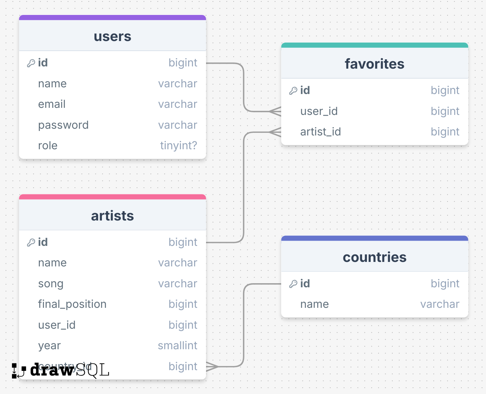

## Changelog

## 28-10-2025

Ik ben vandaag bezig geweest met het maken van de admin dashboard. Ik heb eerst ervoor gezorgd dat een user_id meegaat
als je een artist aanmaakt, zodat ik die op de admin page kan tonen. Je kan nu de status op published zetten of
unpublished waardoor die niet meer te zien is op de index page, ook kan je hem niet editten en de details zien als die
op unpublished staat.
 Ook kan de admin nu artists verwijderen uit de database.
 Er is nu ook een profile pagina. Ook heb ik ervoor gezorgd dat je alleen de artist die jij zelf heb geüpload kan
editten.

## 27-10-2025

Vandaag heb ik ervoor gezorgd dat je afbeeldingen ziet en ook ben ik begonnen aan het admin gedeelte. Ik ben ook
begonnen met de edit pagina.
 Ik ben thuis verder gegaan en heb ervoor gezorgd dat de edit pagina van artiesten werkt. Ook heb ik ervoor gezorgd
dat je alleen als admin op het admin dashboard terecht kan komen en anders krijg je een 403 foutmelding.

## 24-10-2025

Ik heb vandaag aan het zoeken/filteren gewerkt. Eerst heb ik nog wat css aangepast bij de index pagina van artists omdat
ik het jaar erbij wilde zetten.
 Bij het filteren ben ik voor dropdown menu's gegaan, omdat anders elk country, year en final position op een rij
moest staan wat niet handig is. Het was eerst wel een beetje ingewikkeld, maar omdat ik al meerdere dingen had gedaan
die er wel een beetje op leken, vooral op de create page was het minder ingewikkeld en uiteindelijk ben ik er best snel
uitgekomen.
 Ook heb ik ervoor gezorgd dat je nu op artiest en nummer kan zoeken via de zoekbalk.

## 20-10-2025

Vandaag heb ik het uiterlijk van de artist pagina gemaakt. Ook heb ik de css voor een artiest toevoegen aangepast.
 Ik heb er voor gezorgd dat wanneer je niet ingelogd bent je niet naar de favorites en create pagina kan gaan.
 Ook heb ik vandaag gemaakt dat wanneer je op de welcome page zit je nu een goede tekst hebt die bij mijn website
past. De css van de login en register pagina heb ik ook aangepast naar mijn website.

## 15-10-2025

Vandaag heb ik ervoor gezorgd dat je via een formulier een artiest kan toevoegen. Ook is er nu een verbinding tussen de
countries tabel en artists. Je kan nu een nieuwe artiest toevoegen waarbij je ook een land kan toevoegen.

## 14-10-2025

Ik heb aan de database gewerkt en geleerd hoe die werkt. Hierbij heb een artists tabel gemaakt en ook heb ik een model
gemaakt. De artiesten worden nu ook uit de database gehaald en in de view getoond.

## 13-10-2025

Ik heb ervoor gezorgd dat als je ingelogd bent je andere dingen ziet bij favorites.blade.php dan dat wanneer je niet
ingelogd bent.
 Ook heb ik aan de homepage, artists en favorites een navbar toegevoegd met linkjes naar elkaar.

## 12-10-2025

User stories:
 Als Songfestival fan wil ik alle artiesten kunnen zien die voor een bepaald land hebben meegedaan, zodat ik snel kan
vinden wie mijn favoriete land heeft vertegenwoordigd.

Als Songfestival fan wil ik alle artiesten kunnen zien die in een bepaald jaar hebben meegedaan, zodat ik kan terugzien
wie er dat jaar deelnamen.

Als Songfestival fan wil ik de details van een artiest kunnen bekijken (bijvoorbeeld land, jaar, nummer, eindpositie),
zodat ik meer te weten kan komen over hun deelname.

Als Songfestival fan wil ik artiesten kunnen sorteren op naam, land, jaar of eindpositie, zodat ik ze makkelijker kan
vergelijken.

Als geregistreerde gebruiker wil ik kunnen inloggen, zodat ik mijn favoriete artiesten, landen of jaren kan opslaan.

Als admin wil ik artiesten, jaren en landen kunnen toevoegen en verwijderen, zodat de informatie up to date blijft.

ERD:

